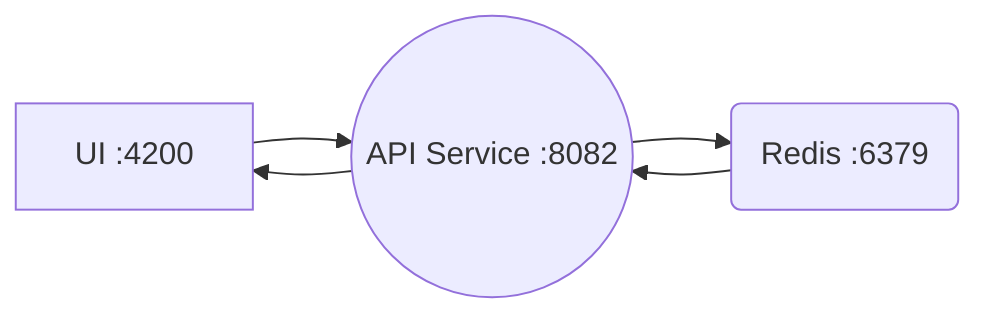

## Technologist Assignment for Modanisa
---

This documentation specifies the tools used in the todo app and how to use it. For the backend, an API server was created with Golang and connected to port 8082. On the frontend, Vue.js technology was used with CDN and requests were specified using the axios library. Nginx was used for broadcasting and 4200 port was determined as port. Data service was provided with Redis and port 6379 was used as the current port. Tests of the application provided. The entire application was dockerized.

---
<h3> Used Technologies</h3>

- **Golang** for backend service.

- **Vue** for frontend.

- **Bootstrap** for UI.

- **Python Selenium** for automation testing.

- **Redis** for data service.

- **Docker** for container technologies.

- **Gitlab** for CI/CD.

- **Kubernetes** for clustering.

- **Google Cloud** for cloud technologies.

---
<h3> Tests</h3>

- Unit Testing 
- Integration Testing 
- Automation Testing 

---

Architecture on the scheme:

---
